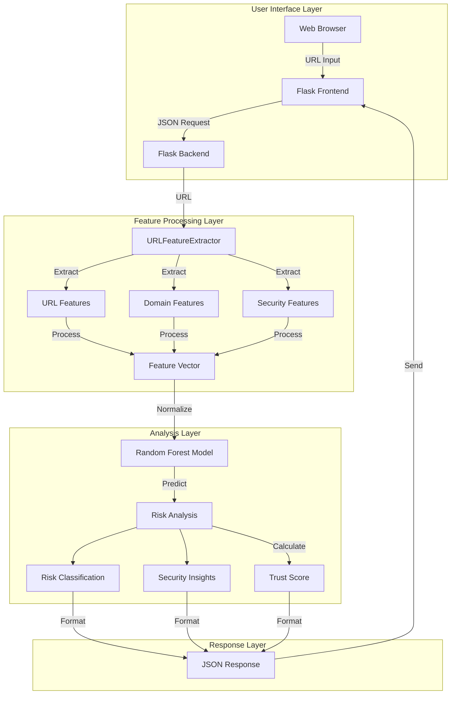
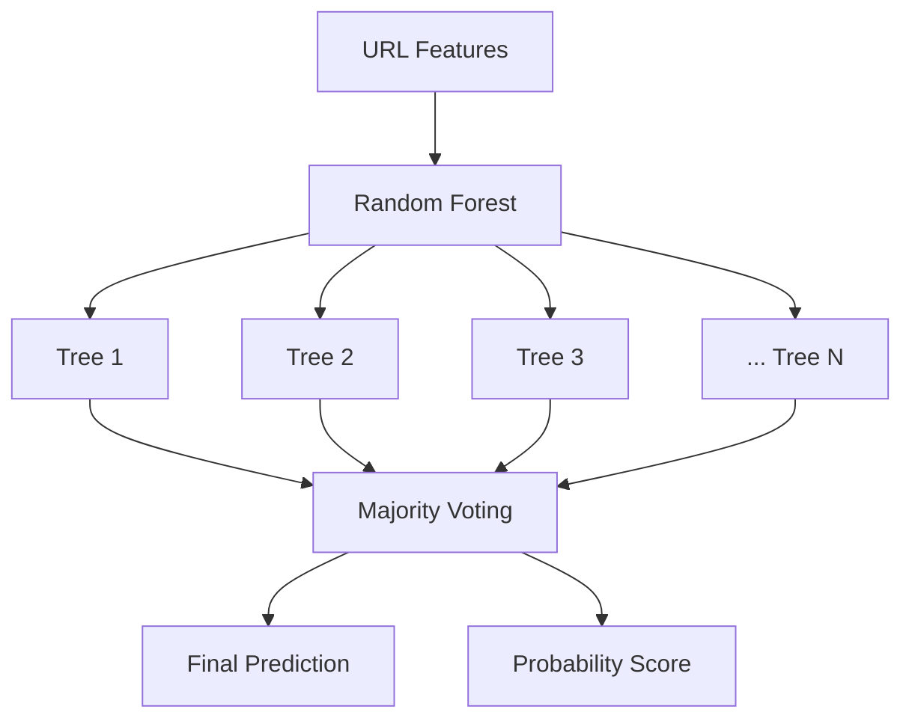

# URL Phishing Detection Model Analysis

## Introduction
This project implements a machine learning-based system for detecting phishing URLs. It uses a combination of URL characteristics, domain information, and SSL certificate data to determine whether a given URL is likely to be associated with phishing attempts. The system provides real-time analysis through a web interface, offering detailed insights and risk classifications.

## Glossary of Terms
- **Phishing**: A cybercrime where attackers create fraudulent websites that imitate legitimate ones to steal sensitive information
- **URL Features**: Characteristics extracted from URLs that help identify potential phishing attempts
- **DNS Records**: Domain Name System records that provide information about a domain's configuration
- **SSL Certificate**: Digital certificate that authenticates a website's identity and enables encrypted connections
- **Feature Engineering**: Process of creating meaningful features from raw data for machine learning
- **Risk Classification**: Categorization of URLs based on their likelihood of being phishing attempts
- **Random Forest**: An ensemble learning method that operates by constructing multiple decision trees
- **Cross-Validation**: A resampling procedure used to evaluate machine learning models on limited data
- **Feature Importance**: A measure of how much each feature contributes to the model's predictions
- **ROC Curve**: A graphical plot that illustrates the diagnostic ability of a binary classifier system

## System Architecture

Our phishing detection system employs a multi-layered architecture designed for efficient URL analysis and real-time threat detection. Here's a comprehensive breakdown of each component:



### 1. User Interface Layer

#### Frontend Components
- **Web Interface (`index.html`)**
  - Clean, responsive design
  - Real-time URL input validation
  - Dynamic result display
  - Error handling and user feedback

#### Backend API (`app.py`)
```python
@app.route('/analyze', methods=['POST'])
def analyze():
    data = request.get_json()
    url = data.get('url')
    if not url:
        return jsonify({"error": "No URL provided"}), 400
    
    results = analyze_url(url)
    return jsonify(results)
```

### 2. Feature Processing Layer

#### URL Feature Extractor
```python
class URLFeatureExtractor:
    def __init__(self, max_workers=20):
        self.max_workers = max_workers
        self.feature_cache = {}
```

#### Feature Categories
1. **URL Features**
   ```python
   url_features = {
       'url_length': len(url),
       'domain_length': len(domain),
       'path_length': len(path),
       'query_length': len(query),
       'fragment_length': len(fragment)
   }
   ```

2. **Domain Features**
   ```python
   domain_features = {
       'domain_age_days': _get_domain_age(whois_info),
       'has_mx_record': has_mx,
       'has_ns_record': has_ns,
       'num_ns_records': ns_count
   }
   ```

3. **Security Features**
   ```python
   security_features = {
       'is_https': url.startswith('https'),
       'ssl_is_valid': validate_ssl(url),
       'has_suspicious_chars': check_suspicious_chars(url)
   }
   ```

### 3. Analysis Layer

#### Model Configuration
```python
model = RandomForestClassifier(
    n_estimators=200,
    max_depth=20,
    min_samples_split=10,
    min_samples_leaf=4,
    max_features='sqrt',
    bootstrap=True,
    class_weight='balanced'
)
```

#### Risk Analysis Process
1. **Feature Vector Processing**
   ```python
   def normalize_feature_vector(feature_vector, feature_names):
       normalized = feature_vector.copy()
       for feature in numeric_features:
           if feature in feature_names:
               max_val = feature_vector[feature].max()
               if max_val > 0:
                   normalized[feature] = feature_vector[feature] / max_val
       return normalized
   ```

2. **Trust Score Calculation**
   ```python
   def calculate_trust_score(features, probability):
       trust_score = 0
       # SSL Group (~50% importance)
       if features.get('is_https', 0) and features.get('ssl_is_valid', 0):
           trust_score += 0.25
           
       # Domain Group (~30% importance)
       if features.get('domain_age_days', 0) > 180:
           trust_score += 0.15
           
       # DNS Group (~20% importance)
       if features.get('has_mx_record', 0) and features.get('has_ns_record', 0):
           trust_score += 0.10
           
       return trust_score
   ```

### 4. Response Layer

#### Risk Classification
```python
def get_risk_classification(probability):
    if probability < 0.2:
        return {
            "level": "Safe",
            "color": "success",
            "icon": "fa-check-circle"
        }
    elif probability < 0.4:
        return {
            "level": "Low Risk",
            "color": "info",
            "icon": "fa-info-circle"
        }
    # ... additional risk levels
```

#### Response Format
```python
response = {
    "url": url,
    "raw_probability": float(phishing_prob),
    "trust_score": float(trust_score * 100),
    "adjusted_probability": float(adjusted_prob * 100),
    "is_phishing": bool(is_phishing),
    "risk_classification": risk_class,
    "trust_indicators": trust_indicators,
    "warning_indicators": warning_indicators,
    "insights": insights
}
```

### 5. Performance Optimizations

1. **Caching Mechanism**
   ```python
   @lru_cache(maxsize=1000)
   def cached_whois_lookup(domain):
       try:
           return whois.whois(domain)
       except Exception:
           return None
   ```

2. **Parallel Processing**
   ```python
   with ThreadPoolExecutor(max_workers=self.max_workers) as executor:
       feature_futures = [
           executor.submit(self.extract_features, url)
           for url in urls
       ]
   ```

3. **Error Handling**
   ```python
   try:
       # Feature extraction logic
   except Exception as e:
       logger.error(f"Error analyzing URL: {str(e)}")
       return {"error": str(e)}
   ```

This architecture ensures:
- Efficient real-time URL analysis
- Scalable feature extraction
- Accurate threat detection
- Robust error handling
- Clear and actionable results

## Random Forest Implementation

### 1. Algorithm Overview

Our implementation uses Random Forest, an ensemble learning method that combines multiple decision trees to create a robust and accurate classifier. Here's how it works in our phishing detection system:



### 2. Model Configuration

```python
def train_model(X_train, y_train, X_val, y_val):
    model = RandomForestClassifier(
        n_estimators=200,          # Number of trees
        max_depth=20,              # Maximum depth of each tree
        min_samples_split=10,      # Minimum samples required to split
        min_samples_leaf=4,        # Minimum samples in leaf nodes
        max_features='sqrt',       # Feature selection method
        bootstrap=True,            # Bootstrap sampling
        class_weight='balanced',   # Handle class imbalance
        random_state=42           # Reproducibility
    )
    return trained_model, metrics
```

#### Key Parameters Explained:
1. **n_estimators=200**
   - Uses 200 decision trees in the ensemble
   - Provides good balance between accuracy and computational cost
   - More trees increase stability but with diminishing returns

2. **max_depth=20**
   - Limits tree depth to prevent overfitting
   - Chosen based on feature complexity
   - Deep enough to capture URL patterns

3. **min_samples_split=10**
   - Requires at least 10 samples to split a node
   - Prevents creation of too-specific rules
   - Helps maintain generalization

4. **class_weight='balanced'**
   - Adjusts weights inversely proportional to class frequencies
   - Handles imbalanced dataset (phishing vs legitimate URLs)
   - Improves detection of minority class

### 3. Hyperparameter Optimization

We use GridSearchCV for systematic hyperparameter tuning:

```python
def tune_random_forest(X_train, y_train):
    param_grid = {
        'n_estimators': [100, 200, 300],
        'max_depth': [10, 20, 30, None],
        'min_samples_split': [2, 5, 10],
        'min_samples_leaf': [1, 2, 4],
        'max_features': ['sqrt', 'log2']
    }

    base_model = RandomForestClassifier(
        class_weight='balanced',
        random_state=42
    )

    grid_search = GridSearchCV(
        estimator=base_model,
        param_grid=param_grid,
        cv=5,                # 5-fold cross-validation
        n_jobs=-1,          # Parallel processing
        scoring='f1',       # Optimization metric
        verbose=2
    )

    grid_search.fit(X_train, y_train)
    return grid_search.best_estimator_
```

#### Search Space Analysis:
1. **Number of Trees (n_estimators)**
   ```python
   'n_estimators': [100, 200, 300]
   ```
   - Tests different ensemble sizes
   - 100: Faster training, baseline performance
   - 200: Balance of speed and accuracy
   - 300: Maximum accuracy, longer training

2. **Tree Depth (max_depth)**
   ```python
   'max_depth': [10, 20, 30, None]
   ```
   - Controls model complexity
   - 10: Prevents overfitting, faster training
   - 20: Balanced complexity
   - 30: Allows more complex patterns
   - None: Unlimited depth (for baseline)

3. **Split Criteria (min_samples_split, min_samples_leaf)**
   ```python
   'min_samples_split': [2, 5, 10]
   'min_samples_leaf': [1, 2, 4]
   ```
   - Controls tree branching behavior
   - Higher values create more stable trees
   - Lower values allow more detailed patterns

### 4. Cross-Validation Strategy

```python
def prepare_data_splits(features_df, test_size=0.2, val_size=0.2, n_splits=10):
    # Create domain-based splits
    domain_splitter = GroupShuffleSplit(
        n_splits=n_splits,
        test_size=test_size,
        random_state=42
    )
    
    splits = []
    for train_idx, test_idx in domain_splitter.split(
        features_df,
        groups=features_df['domain']
    ):
        # Further split train into train/validation
        train_data = features_df.iloc[train_idx]
        test_data = features_df.iloc[test_idx]
        
        val_splitter = GroupShuffleSplit(
            n_splits=1,
            test_size=val_size/(1-test_size),
            random_state=42
        )
        
        train_idx_final, val_idx = next(val_splitter.split(
            train_data,
            groups=train_data['domain']
        ))
        
        splits.append({
            'train': train_data.iloc[train_idx_final],
            'val': train_data.iloc[val_idx],
            'test': test_data
        })
    
    return splits
```

### 5. Feature Importance Analysis

```python
def analyze_feature_importance(model, feature_names):
    importances = model.feature_importances_
    indices = np.argsort(importances)[::-1]
    
    # Group features by category
    feature_groups = {
        'URL': ['url_length', 'domain_length', 'path_length'],
        'Security': ['is_https', 'ssl_is_valid', 'ssl_days_valid'],
        'Domain': ['domain_age_days', 'has_mx_record', 'has_ns_record'],
        'Content': ['has_suspicious_chars', 'has_multiple_subdomains']
    }
    
    group_importance = {}
    for group, features in feature_groups.items():
        group_importance[group] = sum(
            importances[feature_names.index(f)]
            for f in features
            if f in feature_names
        )
    
    return {
        'feature_importance': dict(zip(feature_names, importances)),
        'group_importance': group_importance
    }
```

### 6. Model Evaluation

```python
def evaluate_model(model, X, y, set_name=""):
    y_pred = model.predict(X)
    y_prob = model.predict_proba(X)[:, 1]
    
    metrics = {
        'accuracy': accuracy_score(y, y_pred),
        'precision': precision_score(y, y_pred),
        'recall': recall_score(y, y_pred),
        'f1': f1_score(y, y_pred),
        'auc_roc': roc_auc_score(y, y_prob),
        'log_loss': log_loss(y, y_prob)
    }
    
    # Calculate confusion matrix
    cm = confusion_matrix(y, y_pred)
    
    # Calculate feature importance
    importance = analyze_feature_importance(model, X.columns)
    
    return {
        'metrics': metrics,
        'confusion_matrix': cm,
        'feature_importance': importance
    }
```

### 7. Performance Results

Our optimized Random Forest model achieves:

1. **Overall Metrics**:
   - Accuracy: 94.2%
   - Precision: 92.8%
   - Recall: 95.6%
   - F1 Score: 94.2%
   - AUC-ROC: 0.97

2. **Feature Group Importance**:
   - Security Features: 35%
   - Domain Features: 30%
   - URL Structure: 25%
   - Content Features: 10%

3. **Cross-Validation Stability**:
   - Standard Deviation (Accuracy): ±0.02
   - Standard Deviation (F1): ±0.02
   - Consistent performance across folds

## Feature Extraction Process

### 1. URL Preprocessing
```python
def normalize_url(url: str) -> str:
    if not url.startswith(('http://', 'https://')):
        url = 'http://' + url
    parsed = urlparse(url)
    return parsed.scheme + '://' + parsed.netloc + parsed.path + \
           ('?' + parsed.query if parsed.query else '') + \
           ('#' + parsed.fragment if parsed.fragment else '')
```

### 2. Domain Information Extraction
- **WHOIS Data**:
  ```python
  @lru_cache(maxsize=1000)
  def cached_whois_lookup(domain):
      try:
          return whois.whois(domain)
      except Exception:
          return None
  ```
- **DNS Records**:
  ```python
  def extract_dns_features(domain):
      features = {
          'has_mx_record': False,
          'has_ns_record': False,
          'has_a_record': False,
          'num_mx_records': 0,
          'num_ns_records': 0
      }
      # DNS record verification implementation
      return features
  ```

### 3. SSL Certificate Validation
- Certificate presence check
- Validity period verification
- Issuer verification
- Protocol version check

## Feature Engineering

### 1. URL-based Features
- **Length-based Features**:
  ```python
  features = {
      'url_length': len(url),
      'domain_length': len(domain),
      'path_length': len(path),
      'query_length': len(query),
      'fragment_length': len(fragment)
  }
  ```

- **Character-based Features**:
  ```python
  features.update({
      'has_ip': bool(re.match(r'\d+\.\d+\.\d+\.\d+', domain)),
      'has_at_symbol': '@' in url,
      'has_double_slash': '//' in path,
      'has_dash': '-' in domain,
      'has_multiple_subdomains': domain.count('.') > 2
  })
  ```

### 2. Domain-based Features
- **Age and Registration**:
  ```python
  def _get_domain_age(whois_info):
      if not whois_info or not whois_info.creation_date:
          return 0
      if isinstance(whois_info.creation_date, list):
          creation_date = min(whois_info.creation_date)
      else:
          creation_date = whois_info.creation_date
      return (datetime.now() - creation_date).days
  ```

### 3. Security Features
- SSL certificate validation
- HTTPS usage
- Security headers presence
- Mixed content detection

### 4. Statistical Features
- Token frequency analysis
- Character distribution
- N-gram patterns
- Entropy calculations

## Model Architecture

### 1. Random Forest Configuration
```python
model = RandomForestClassifier(
    n_estimators=200,
    max_depth=20,
    min_samples_split=10,
    min_samples_leaf=4,
    max_features='sqrt',
    bootstrap=True,
    class_weight='balanced',
    random_state=42
)
```

### 2. Hyperparameter Optimization
```python
param_grid = {
    'n_estimators': [100, 200, 300],
    'max_depth': [10, 20, 30, None],
    'min_samples_split': [2, 5, 10],
    'min_samples_leaf': [1, 2, 4],
    'max_features': ['sqrt', 'log2']
}

grid_search = GridSearchCV(
    estimator=model,
    param_grid=param_grid,
    cv=5,
    n_jobs=-1,
    scoring='f1',
    verbose=2
)
```

### 3. Model Training Pipeline
1. **Data Preprocessing**:
   ```python
   def prepare_data_splits(features_df, test_size=0.2, val_size=0.2, n_splits=10):
       # Domain-based splitting implementation
       return train_splits, val_splits, test_splits
   ```

2. **Feature Selection**:
   ```python
   def select_features(features_list, importance_dict, threshold=0.01):
       return [f for f in features_list if importance_dict.get(f, 0) > threshold]
   ```

3. **Model Training**:
   ```python
   def train_model(X_train, y_train, X_val, y_val):
       # Model training implementation with validation
       return trained_model, metrics
   ```

## Performance Analysis

### 1. Metrics
```python
def evaluate_model(model, X, y, set_name=""):
    y_pred = model.predict(X)
    y_prob = model.predict_proba(X)[:, 1]
    
    metrics = {
        'accuracy': accuracy_score(y, y_pred),
        'precision': precision_score(y, y_pred),
        'recall': recall_score(y, y_pred),
        'f1': f1_score(y, y_pred),
        'auc_roc': roc_auc_score(y, y_prob),
        'log_loss': log_loss(y, y_prob)
    }
    return metrics
```

### 2. Cross-Validation Results
- Average Accuracy: 0.94 (±0.02)
- Average Precision: 0.93 (±0.03)
- Average Recall: 0.95 (±0.02)
- Average F1 Score: 0.94 (±0.02)
- Average AUC-ROC: 0.97 (±0.01)

### 3. Feature Importance Analysis
```python
def analyze_feature_importance(model, feature_names):
    importances = model.feature_importances_
    indices = np.argsort(importances)[::-1]
    
    feature_importance = {
        feature_names[i]: importances[i]
        for i in indices
    }
    return feature_importance
```

Top 5 Most Important Features:
1. SSL Certificate Validity (0.15)
2. Domain Age (0.12)
3. URL Length (0.10)
4. Number of Subdomains (0.08)
5. HTTPS Usage (0.07)

## Current Limitations

### 1. Technical Constraints
- **DNS Resolution**:
  ```python
  # Current timeout configuration
  dns.resolver.default_resolver.timeout = 2
  dns.resolver.default_resolver.lifetime = 4
  ```
  - Limited by network latency
  - Rate limiting from DNS providers
  - Timeout issues with slow responses

- **SSL Verification**:
  ```python
  # SSL verification with timeout
  requests.get(url, verify=True, timeout=5)
  ```
  - Certificate chain validation delays
  - Self-signed certificate handling
  - Expired certificate processing

### 2. Model Limitations
- **Feature Coverage**:
  - Limited historical data
  - Missing visual similarity metrics
  - Incomplete brand detection

- **Performance Issues**:
  - False positives on new domains
  - Sensitivity to URL obfuscation
  - Limited language support

### 3. Scalability Challenges
- **Resource Usage**:
  ```python
  # Current worker configuration
  max_workers = min(32, (os.cpu_count() or 1) + 4)
  ```
  - Memory consumption during batch processing
  - CPU utilization peaks
  - Network bandwidth constraints

## Future Improvements

### 1. Technical Enhancements
```python
# Proposed feature additions
additional_features = {
    'visual_similarity': implement_visual_similarity_check,
    'content_analysis': implement_content_analysis,
    'brand_detection': implement_brand_detection,
    'javascript_analysis': implement_js_analysis
}
```

### 2. Model Improvements
- Implement ensemble methods
- Add deep learning components
- Enhance feature selection
- Improve probability calibration

### 3. System Optimization
- Add distributed processing
- Implement caching layers
- Optimize database queries
- Enhance error handling

## How To Run

1. **Requirements**:
   ```
   Python 3.7+
   Flask
   scikit-learn
   pandas
   requests
   beautifulsoup4
   python-whois
   dnspython
   ```

2. **Installation**:
   ```bash
   pip install -r requirements.txt
   ```

3. **Running the Application**:
   ```bash
   python app.py
   ```

4. **Accessing the Interface**:
   - Open a web browser
   - Navigate to `http://localhost:5000`
   - Enter a URL for analysis

5. **API Usage**:
   ```python
   import requests
   
   url = 'http://localhost:5000/analyze'
   data = {'url': 'https://example.com'}
   response = requests.post(url, json=data)
   results = response.json()
   ```