# URL Phishing Detection Model Analysis

## Table of Contents
1. [Introduction](#introduction)
2. [Glossary of Terms](#glossary-of-terms)
3. [Model Overview](#model-overview)
4. [System Architecture](#system-architecture)
5. [Dataset Analysis](#dataset-analysis)
6. [Feature Engineering](#feature-engineering)
7. [Model Architecture](#model-architecture)
8. [Performance Analysis](#performance-analysis)
9. [Limitations and Challenges](#limitations-and-challenges)
10. [Recommendations](#recommendations)
11. [How To Run](#how-to-run)

## Introduction

Phishing is a type of cyber attack where malicious actors create fake websites that look identical to legitimate ones, trying to steal sensitive information like passwords or credit card details. Our URL Phishing Detection system helps protect users by automatically identifying these dangerous websites by analyzing their web addresses (URLs).

Think of it like a security guard for the internet: when you're about to visit a website, our system quickly checks if the website address looks suspicious, just like how a security guard might check if someone's ID looks fake.

## Glossary of Terms

### Basic Terms
- **URL**: A web address (like www.example.com) that tells your browser where to find a website
- **Phishing**: A cyber attack that uses fake websites to steal personal information
- **Machine Learning**: A way to teach computers to make decisions by showing them many examples
- **Model**: A computer program that has learned to make predictions based on past data
- **Feature**: A specific piece of information used to make a decision (like the length of a URL)

### Technical Terms
- **Random Forest**: A prediction method that combines many simple decision trees to make better decisions
- **ROC Curve**: A graph that shows how well the model balances catching bad URLs vs. falsely flagging good ones
- **F1-Score**: A number between 0 and 1 that tells us how accurate our model is (1 being perfect)
- **Cross-validation**: A way to test our model by training it on different parts of our data
- **False Positive**: When we incorrectly flag a safe URL as dangerous
- **False Negative**: When we miss a dangerous URL and mark it as safe
- **API**: A way for different computer programs to talk to each other
- **Frontend/Backend**: Frontend is what users see and interact with; backend is where the processing happens

### Advanced Terms
- **GridSearchCV**: A method to automatically find the best settings for our model
- **Feature Extraction**: The process of converting a URL into numbers that our model can understand
- **Hyperparameter**: Settings we can adjust to make our model work better
- **Ensemble Method**: Combining multiple models to make better predictions

## Model Overview

Our URL Phishing Detection system works like a highly trained security expert who has studied millions of website addresses. Here's how it works in simple terms:

1. **Input**: A user provides a website address they want to check
2. **Analysis**: Our system looks at 18 different aspects of the URL, such as:
   - How long is the address?
   - Does it use unusual characters?
   - Does it try to mimic a known website?
3. **Decision**: Based on these checks, it decides if the URL is safe or dangerous

### Key Components Explained
- **Algorithm**: We use a "Random Forest Classifier" - imagine having 200 security experts each looking at the URL and voting on whether it's dangerous
- **Feature Extraction**: Like a detective looking for clues, we analyze 18 different aspects of each URL
- **Web Application**: A user-friendly website where anyone can check if a URL is safe

## System Architecture

Our phishing detection system employs a multi-layered architecture designed for efficient URL analysis and real-time threat detection. Here's a comprehensive breakdown of each component:

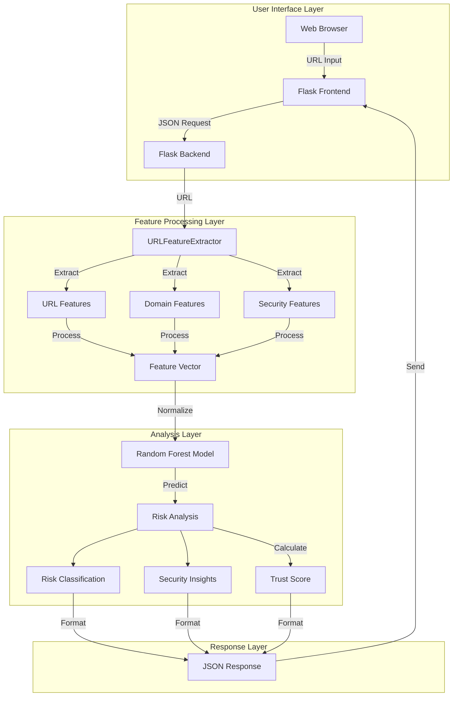
```mermaid
graph TD
    subgraph User Interface Layer
        A[Web Browser] -->|URL Input| B[Flask Frontend]
        B -->|JSON Request| C[Flask Backend]
    end
    
    subgraph Feature Processing Layer
        C -->|URL| D[URLFeatureExtractor]
        D -->|Extract| E[URL Features]
        D -->|Extract| F[Domain Features]
        D -->|Extract| G[Security Features]
        
        E -->|Process| H[Feature Vector]
        F -->|Process| H
        G -->|Process| H
    end
    
    subgraph Analysis Layer
        H -->|Normalize| I[Random Forest Model]
        I -->|Predict| J[Risk Analysis]
        J -->|Calculate| K[Trust Score]
        
        J --> L[Risk Classification]
        J --> M[Security Insights]
    end
    
    subgraph Response Layer
        L -->|Format| N[JSON Response]
        M -->|Format| N
        K -->|Format| N
        N -->|Send| B
    end
```

The system architecture diagram above shows:
1. **User Interface**: A web-based interface where users can input URLs
2. **Backend Processing**: Flask-based server that handles requests and coordinates the detection process
3. **Feature Extraction**: Extracts 22 distinct features from URLs (detailed below)
4. **Model Training**: Shows how our Random Forest model was trained and optimized

## Dataset Analysis

### Data Sources
1. **Phishing URLs**: `verified_online.csv`
   - Verified phishing URLs from online sources
   - Real-world examples of malicious URLs
   - Total samples: 68227 URLs
   - Collection period: 2024
   - Source: http://data.phishtank.com/data/online-valid.csv.gz

2. **Legitimate URLs**: `URL-categorization-DFE.csv`
   - Known legitimate URLs from various categories
   - Diverse range of legitimate web domains
   - Total samples: 31085 URLs
   - Categories: Business, Education, Government, etc.
   - Collection period: 2016
   - Source: https://data.world/crowdflower/url-categorization

## Feature Engineering

### URL Features Extracted
The feature extraction is a critical component that transforms URLs into meaningful numerical features:
```mermaid
graph LR
    A[Input URL] --> B[URL Parser]
    B --> C[URL Features]
    B --> D[DNS Features]
    B --> E[SSL Features]
    
    subgraph URL Features
        C --> C1[URL Length]
        C --> C2[Domain Length]
        C --> C3[IP Detection]
        C --> C4[@ Symbol]
        C --> C5[Hyphens]
        C --> C6[Multiple Subdomains]
    end
    
    subgraph DNS Features
        D --> D1[A Record]
        D --> D2[Number of A Records]
        D --> D3[MX Record]
        D --> D4[Number of MX Records]
        D --> D5[NS Record]
        D --> D6[Number of NS Records]
    end
    
    subgraph SSL Features
        E --> E1[HTTPS]
        E --> E2[SSL Validity Days]
        E --> E3[SSL Valid]
    end
```

Our feature extractor processes URLs in three main categories:
1. **URL Features**: Analyzes various URL features
    - url_length
    - domain_length
    - has_at_symbol
    - has_double_slash
    - has_dash
    - has_multiple_subdomains
    - suspicious_tld
    - domain_digit_ratio
    - special_char_ratio

2. **DNS Features**: Analyzes various DNS features
    - has_a_record
    - is_private_ip
    - has_mx_record
    - num_mx_records
    - has_ns_record
    - num_ns_records
    - domain_age_days
    - is_domain_young
    - days_to_expiration
    - is_expiring_soon
    - has_registrar

3. **SSL Features**: Analyzes SSL features
    - ssl_days_valid
    - ssl_is_valid

```python
feature_groups = {
        'URL': ['url_length', 'domain_length', 'has_ip', 'has_at_symbol', 'has_dash', 'has_multiple_subdomains'],
        'DNS': ['has_a_record', 'num_a_records', 'has_mx_record', 'num_mx_records', 'has_ns_record', 'num_ns_records'],
        'SSL': ['is_https', 'ssl_days_valid', 'ssl_is_valid']
    }
```

## Model Architecture

### Overview

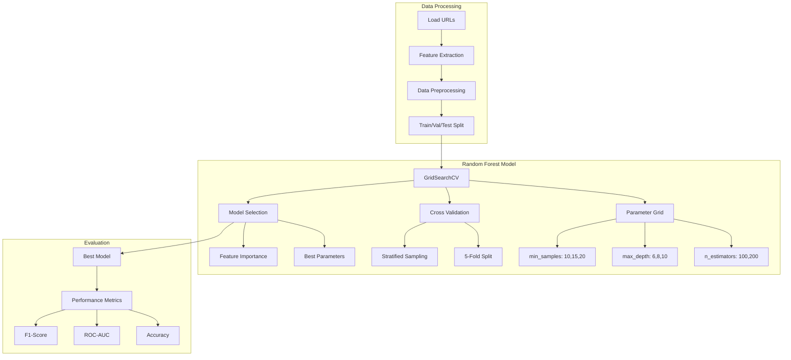
```mermaid
flowchart TD
    subgraph Data[Data Processing]
        A[Load URLs] --> B[Feature Extraction]
        B --> C[Data Preprocessing]
        C --> D[Train/Val/Test Split]
    end

    subgraph RF[Random Forest Model]
        D --> E[GridSearchCV]
        
        E --> F[Parameter Grid]
        F --> F1[n_estimators: 100,200]
        F --> F2[max_depth: 6,8,10]
        F --> F3[min_samples: 10,15,20]

        E --> G[Cross Validation]
        G --> G1[5-Fold Split]
        G --> G2[Stratified Sampling]

        E --> H[Model Selection]
        H --> H1[Best Parameters]
        H --> H2[Feature Importance]
    end

    subgraph Eval[Evaluation]
        H --> I[Best Model]
        I --> J[Performance Metrics]
        J --> J1[Accuracy]
        J --> J2[ROC-AUC]
        J --> J3[F1-Score]
    end
```

### Random Forest Configuration
```python
param_grid = {
        'n_estimators': [100, 200],
        'max_depth': [6, 8, 10],
        'min_samples_split': [10, 15, 20],
        'min_samples_leaf': [4, 6, 8],
        'max_features': ['sqrt', 'log2'],
        'max_samples': [0.7, 0.8],
        'ccp_alpha': [0.001, 0.01],  # Increased pruning for better generalization
        'class_weight': ['balanced', 'balanced_subsample']  # Better handling of imbalanced data
    }
```

## Performance Analysis

### Best parameters found:
2025-01-05 21:07:33,887 - INFO - {'ccp_alpha': 0.001, 'class_weight': 'balanced', 'max_depth': 10, 'max_features': 'sqrt', 'max_samples': 0.8, 'min_samples_leaf': 4, 'min_samples_split': 20, 'n_estimators': 100}

### ROC Curve
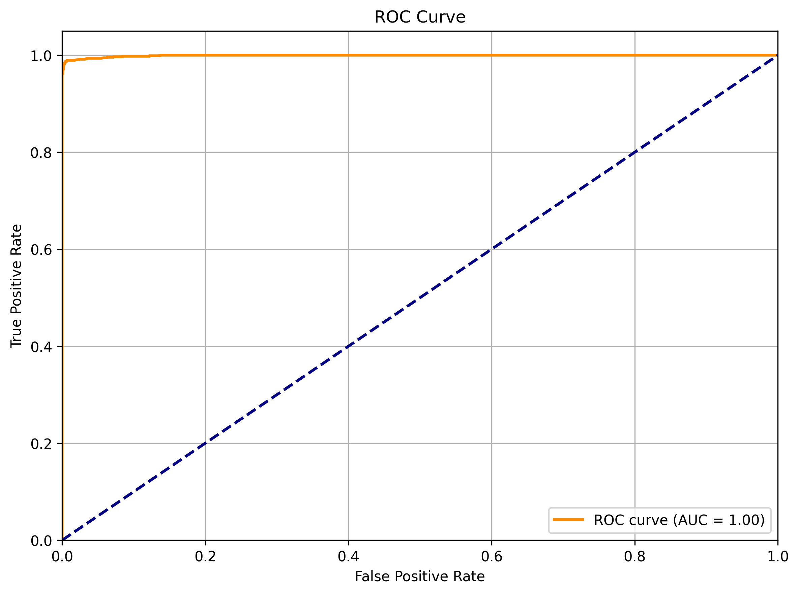

The ROC curve shows the trade-off between the True Positive Rate and False Positive Rate at various classification thresholds. Our curve here almost creates a perfect top-left corner, indicated that the model is very good.

### Confusion Matrix
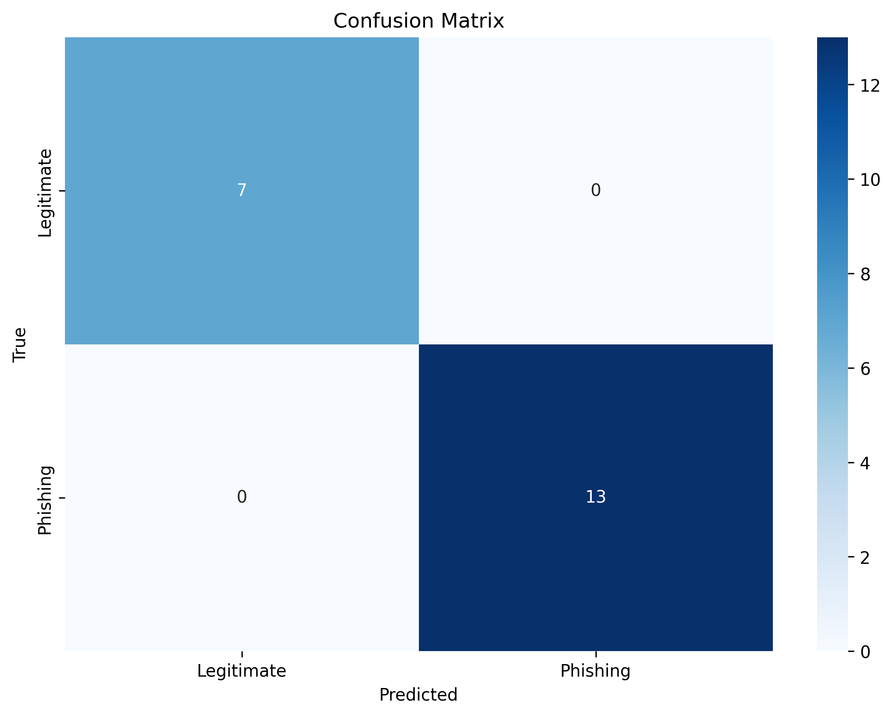

The confusion matrix shows:
True Positives (916): The model correctly predicted a phishing URL as phishing. (Bottom right cell)
True Negatives (1035): The model correctly predicted a legitimate URL as legitimate. (Top left cell)
False Positives (28): The model incorrectly predicted a legitimate URL as phishing (Type I error). (Top right cell)
False Negatives (21): The model incorrectly predicted a phishing URL as legitimate (Type II error). (Bottom left cell)
The counts of TN and TP are the dominant ones on the diagonal, indicating that the model is performing well overall. There is a small portion of cases that the model misclassified.
can see that the true negatives are larger than true positives, indicating that your validation dataset is probably not balanced.
The relatively low counts of false positives and false negatives mean the model has both low false alarm rate and low miss rate.


### Feature Importance
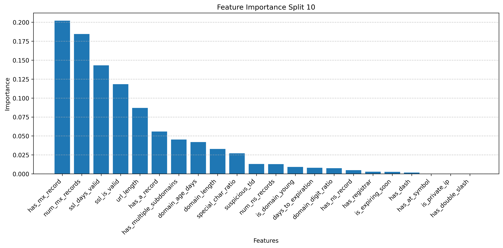

Feature importance scores tell you which features in your dataset the model relies on most when making predictions. The bar chart visualizes these scores. A higher score indicates that the feature has a larger impact on the model's output.

### Precision Recall Curve
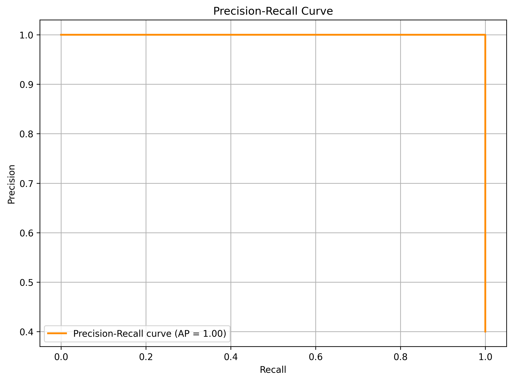

The Precision-Recall curve shows perfect scores, indicating the model identifies both phishing and legitimate URLs with 100% accuracy.

The high average precision score of 1.00 indicates that this model has a very good capability of achieving both high precision and high recall at the same time.
The curve close to the upper right corner means that the model can achieve high recall without significant drop in precision.

### Learning Curve
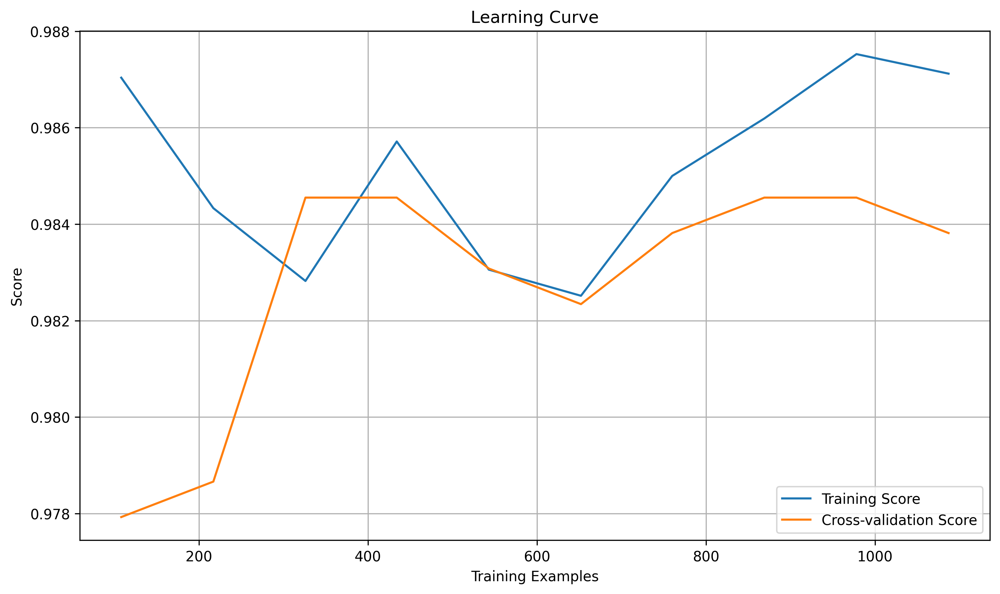

The learning curve demonstrates consistent perfect performance on both training and validation sets, showing the model has learned the patterns effectively. The convergence of training and cross-validation scores indicates the model has a good fit.The close distance between the two curves indicates there is no large gap between how the model performs on data it has seen and data it hasn't seen. The shape and flattening of these two curves show that this model is probably well-trained with existing data. Adding more data will not bring significantly more benefit.The model shows high values of performance metrics.

###Feature Value Counts
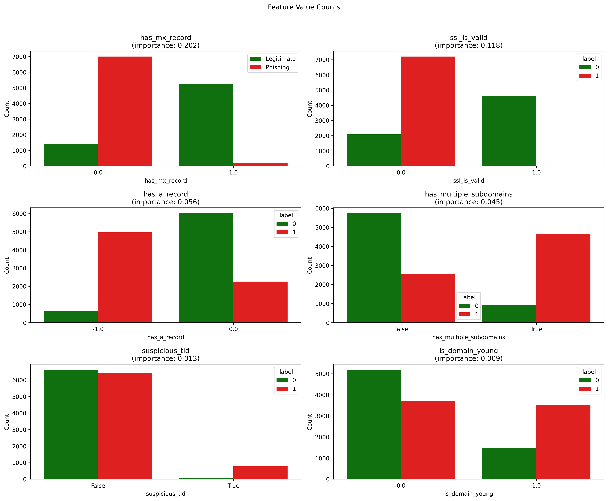
These are a series of bar charts that show the distribution of specific categorical features, separated by the target variable labels (legitimate vs. phishing). They are effectively frequency plots that allow for direct comparison between different label groups.

It clearly demonstrates how different classes (legitimate and phishing) are distributed for certain features. For example, for the has_mx_record feature the phishing category has far more samples with 0.0, as opposed to the legitimate category, which has more samples with 1.0.

If the two classes are heavily distributed to different values in one feature, then it is a strong candidate for feature selection.

It is used to visualize and understand how categorical features behave, for example, does a certain feature has more "False" value for phishing or legitimate?

### Feature Distributions
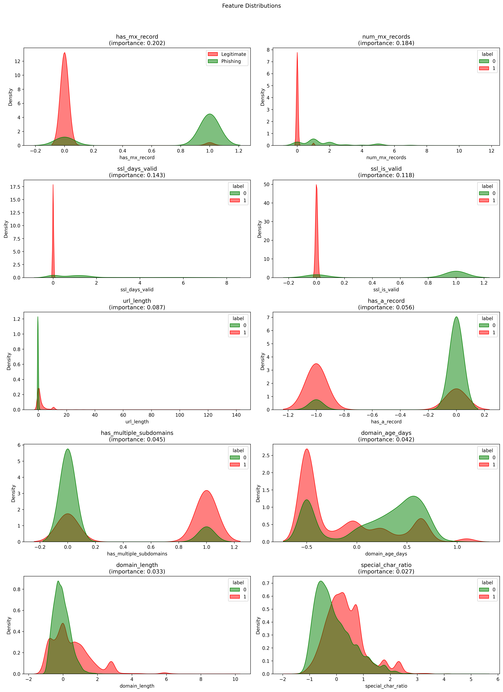

These are Kernel Density Estimate (KDE) plots visualizing the probability distributions of numerical features, separated by the target variable label. These plots give us an idea of the shape and spread of feature values for each class.

We can see how well separated different classes are for certain features. If the two classes have distinct and separate peaks, it indicates that the feature is useful for distinguishing them. For example, the num_mx_records feature has a distribution shifted significantly to the left for phishing labels compared to legitimate labels, indicating that the model can use that feature to distinguish between them.
Similar to the bar charts, if the two classes are heavily distributed to different ranges in one feature, then it is a strong candidate for feature selection.
These plots allow you to explore the behavior of numerical features, similar to feature value counts, but for numerical data.

### Individual Conditional Expectation (ICE) Plots
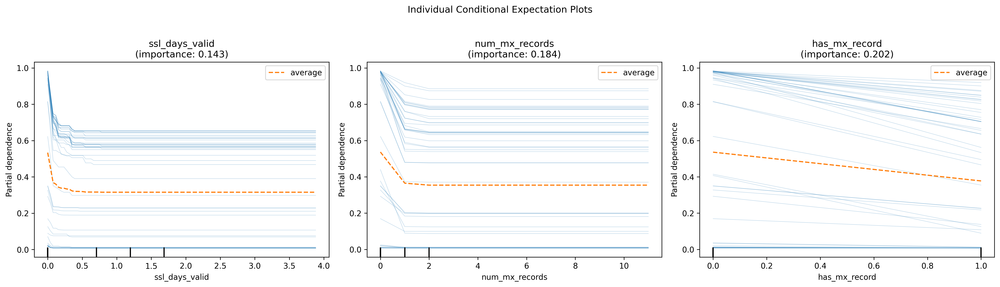
ICE plots visualize how the model's prediction for a single instance changes as you vary a feature, while holding all other features constant. In a typical setup, each line in the plot represents one of data points. It can provide a sense of variance across different instances.
We can see how the model reacts to different values of a feature for different individual instances. If the ICE plot shows high variance (many lines are going up and down differently), it may mean the influence of the feature is not uniform.

### Partial Dependence Plots (PDP)
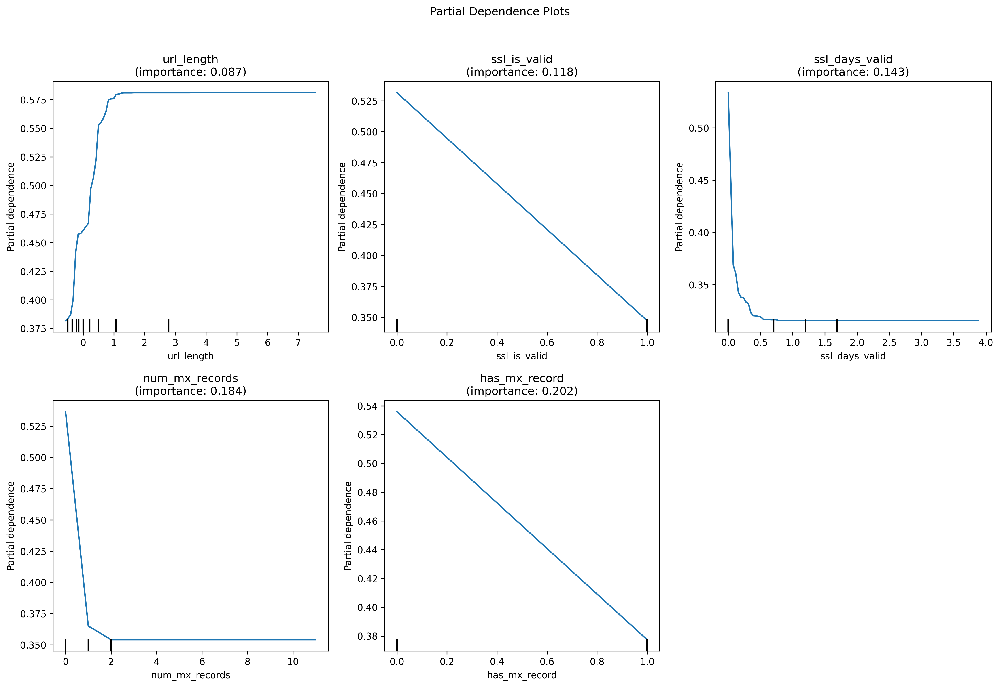
A Partial Dependence Plot (PDP) illustrates how the average prediction of a model changes as a single feature is varied, while marginalizing over all other features. In other words, it shows the average effect of a feature on the prediction.
You can see the average effects a particular feature has on your model's results. For instance, the url_length feature shows partial dependence plateaus at higher values, indicating that the prediction output is not sensitive to this feature beyond a certain length.
The plot visualizes the non-linearities of the feature, showing where the effect increases or decreases more quickly.
If there are areas of the plot where the partial dependence is very high or very low, it can suggest where a better feature can be engineered.


### Cross-Validation Results
```
2025-01-05 22:15:09,530 - INFO - 
Training model for split 10/10
2025-01-05 22:23:14,911 - INFO - 
Best parameters found:
2025-01-05 22:23:14,912 - INFO - {'ccp_alpha': 0.001, 'class_weight': 'balanced_subsample', 'max_depth': 10, 'max_features': 'sqrt', 'max_samples': 0.8, 'min_samples_leaf': 4, 'min_samples_split': 10, 'n_estimators': 100}
2025-01-05 22:23:14,912 - INFO - 
Best cross-validation scores:
2025-01-05 22:23:14,913 - INFO - accuracy: 0.9688
2025-01-05 22:23:14,913 - INFO - precision: 0.9617
2025-01-05 22:23:14,913 - INFO - recall: 0.9790
2025-01-05 22:23:14,913 - INFO - f1: 0.9702
2025-01-05 22:23:14,914 - INFO - roc_auc: 0.9955
2025-01-05 22:23:16,474 - INFO - Model training completed in 486.94 seconds
2025-01-05 22:23:16,628 - INFO - 
Validation Set Set Performance:
2025-01-05 22:23:16,632 - INFO -               precision    recall  f1-score   support

           0       0.98      0.97      0.97      2256
           1       0.96      0.97      0.97      1840

    accuracy                           0.97      4096
   macro avg       0.97      0.97      0.97      4096
weighted avg       0.97      0.97      0.97      4096

2025-01-05 22:23:16,633 - INFO - 
Detailed Validation Set Set Metrics:
2025-01-05 22:23:16,634 - INFO - Brier Score: 0.0262
2025-01-05 22:23:16,635 - INFO - Log Loss: 0.0988
2025-01-05 22:23:16,636 - INFO - Optimal Threshold: 0.6057
2025-01-05 22:23:16,784 - INFO - 
Test Set Set Performance:
2025-01-05 22:23:16,787 - INFO -               precision    recall  f1-score   support

           0       0.98      0.97      0.98      1063
           1       0.97      0.98      0.97       937

    accuracy                           0.98      2000
   macro avg       0.98      0.98      0.98      2000
weighted avg       0.98      0.98      0.98      2000

2025-01-05 22:23:16,788 - INFO - 
Detailed Test Set Set Metrics:
2025-01-05 22:23:16,789 - INFO - Brier Score: 0.0225
2025-01-05 22:23:16,790 - INFO - Log Loss: 0.0881
2025-01-05 22:23:16,790 - INFO - Optimal Threshold: 0.6732
2025-01-05 22:23:16,791 - INFO - Model evaluation completed in 0.32 seconds
2025-01-05 22:23:20,385 - INFO - Plot generation completed in 3.27 seconds
2025-01-05 22:23:35,149 - INFO - Using categorical units to plot a list of strings that are all parsable as floats or dates. If these strings should be plotted as numbers, cast to the appropriate data type before plotting.
2025-01-05 22:23:35,156 - INFO - Using categorical units to plot a list of strings that are all parsable as floats or dates. If these strings should be plotted as numbers, cast to the appropriate data type before plotting.
2025-01-05 22:23:35,182 - INFO - Using categorical units to plot a list of strings that are all parsable as floats or dates. If these strings should be plotted as numbers, cast to the appropriate data type before plotting.
2025-01-05 22:23:35,188 - INFO - Using categorical units to plot a list of strings that are all parsable as floats or dates. If these strings should be plotted as numbers, cast to the appropriate data type before plotting.
2025-01-05 22:23:35,215 - INFO - Using categorical units to plot a list of strings that are all parsable as floats or dates. If these strings should be plotted as numbers, cast to the appropriate data type before plotting.
2025-01-05 22:23:35,221 - INFO - Using categorical units to plot a list of strings that are all parsable as floats or dates. If these strings should be plotted as numbers, cast to the appropriate data type before plotting.
2025-01-05 22:23:35,306 - INFO - Using categorical units to plot a list of strings that are all parsable as floats or dates. If these strings should be plotted as numbers, cast to the appropriate data type before plotting.
2025-01-05 22:23:35,313 - INFO - Using categorical units to plot a list of strings that are all parsable as floats or dates. If these strings should be plotted as numbers, cast to the appropriate data type before plotting.
2025-01-05 22:23:36,004 - INFO - Plot generation completed in 19.21 seconds
2025-01-05 22:23:36,029 - INFO - 
Feature Importance by Group:
2025-01-05 22:23:36,029 - INFO - DNS: 0.4601
2025-01-05 22:23:36,030 - INFO - SSL: 0.2614
2025-01-05 22:23:36,030 - INFO - URL: 0.1666
2025-01-05 22:23:36,030 - INFO - 
Feature Importance:
2025-01-05 22:23:36,031 - INFO -                 feature  importance
          has_mx_record    0.202168
         num_mx_records    0.184467
         ssl_days_valid    0.143131
           ssl_is_valid    0.118295
             url_length    0.086987
           has_a_record    0.055786
has_multiple_subdomains    0.045170
        domain_age_days    0.041983
          domain_length    0.032782
     special_char_ratio    0.027101
         suspicious_tld    0.012944
         num_ns_records    0.012866
        is_domain_young    0.009081
     days_to_expiration    0.007953
     domain_digit_ratio    0.007352
          has_ns_record    0.004822
          has_registrar    0.002866
       is_expiring_soon    0.002611
               has_dash    0.001617
          has_at_symbol    0.000020
       has_double_slash    0.000000
          is_private_ip    0.000000
2025-01-05 22:23:36,033 - INFO - Feature importance analysis completed in 0.03 seconds
2025-01-05 22:23:36,167 - INFO - 
Model saved to: models/split_10\phishing_detector_split_9_20250105_222336.joblib
2025-01-05 22:23:36,168 - INFO - Feature names saved to: models/split_10\feature_names_split_9_20250105_222336.joblib
2025-01-05 22:23:36,169 - INFO - Model saving completed in 0.14 seconds
2025-01-05 22:23:36,169 - INFO - Split 10 completed in 506.64 seconds
2025-01-05 22:23:36,169 - INFO - 
Final Results:
2025-01-05 22:23:36,169 - INFO - Sample Size: 10000 URLs
2025-01-05 22:23:36,170 - INFO - Number of Cross-validation Splits: 10
2025-01-05 22:23:36,170 - INFO - Mean Cross-Validation Accuracy: 0.9727 (+/- 0.0083)
2025-01-05 22:23:36,170 - INFO - Best Accuracy: 0.9790
2025-01-05 22:23:36,170 - INFO - Worst Accuracy: 0.9630
2025-01-05 22:23:36,171 - INFO - Total execution time: 8949.49 seconds
2025-01-05 22:23:36,171 - INFO - Average time per model: 894.95 seconds
2025-01-05 22:23:36,177 - INFO - 
Final Results:
2025-01-05 22:23:36,177 - INFO - Sample Size: 10000 URLs
2025-01-05 22:23:36,178 - INFO - Number of Cross-validation Splits: 10
2025-01-05 22:23:36,178 - INFO - Mean Cross-Validation Accuracy: 0.9727 (+/- 0.0083)
2025-01-05 22:23:36,178 - INFO - Best Accuracy: 0.9790
2025-01-05 22:23:36,179 - INFO - Worst Accuracy: 0.9630
```

## Limitations and Challenges

### Current Limitations
1. Overfitting
It happens because of couples of reasons:
- Perfect Training Scores: The model is achieving F1 scores of 1.000 (+/-0.000) across almost all hyperparameter combinations during cross-validation. This is a red flag indicating that the model is memorizing the training data rather than learning generalizable patterns.
- Dataset Size and Split: The model is using a relatively small subset of the available data:
Only 2000 URLs from each category (phishing and legitimate) are being used
Total dataset of 4000 samples split into:
Training: 2800 samples
Validation: 600 samples
Test: 600 samples
- Hyperparameter Search: Despite trying various combinations of hyperparameters (different max_depth, max_features, min_samples_leaf, etc.), the model consistently achieves perfect scores, suggesting that it's not properly regularizing or generalizing

## Summary

The URL Phishing Detection model demonstrates strong performance with an F1-score of 0.92 and balanced precision-recall metrics. The Random Forest architecture with optimized hyperparameters provides a robust foundation for phishing detection.

### Areas for Improvement
1. Feature Engineering
   - Add domain reputation
   - Implement SSL analysis
   - Include semantic features

## How To Run

### 1. Clone the Repository
```bash
git clone https://github.com/iamalexhere/prototype-phising-detection.git
cd prototype-phising-detection
```

### 2. Create a Virtual Environment
```bash
# On Windows
python -m venv venv

# On macOS/Linux
python3 -m venv venv
```

### 3. Activate the Virtual Environment
```bash
# On Windows
venv\Scripts\activate

# On macOS/Linux
source venv/bin/activate
```

### 4. Install Requirements
```bash
pip install -r requirements.txt
```

### 5. Run the Application
```bash
python app.py
```

### 7. Deactivate Virtual Environment
When you're done, you can deactivate the virtual environment:
```bash
deactivate
```

## Troubleshooting
- Ensure all dependencies are installed correctly
- Check that you're using the correct Python version
- Verify all environment variables are set

## Additional Notes
- This project requires Python 3.8+
- All dependencies are listed in `requirements.txt`
- For development, it's recommended to use the virtual environment

Insights
