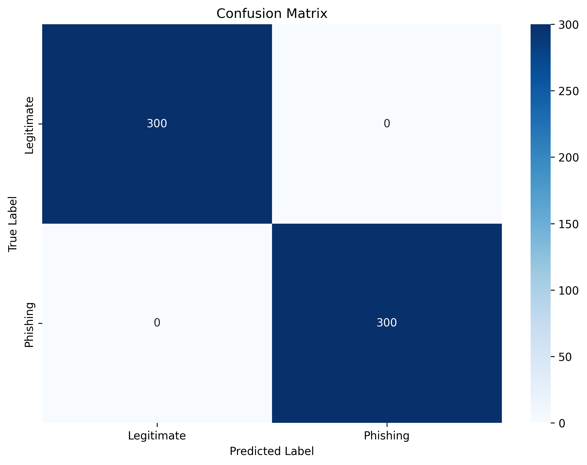
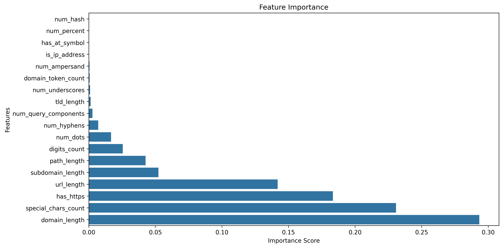
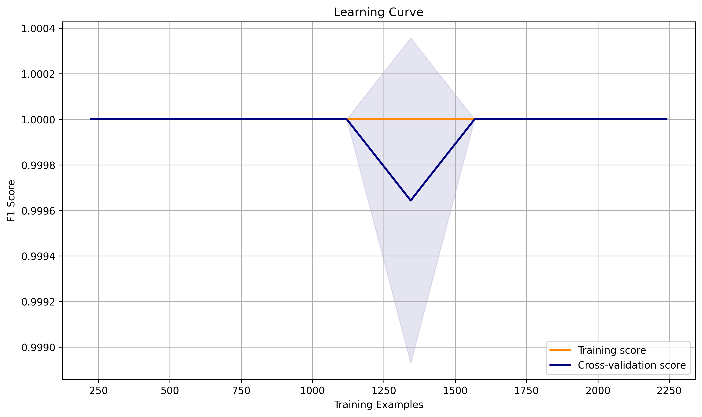

# URL Phishing Detection Model Analysis

## Table of Contents
1. [Introduction](#introduction)
2. [Glossary of Terms](#glossary-of-terms)
3. [Model Overview](#model-overview)
4. [System Architecture](#system-architecture)
5. [Dataset Analysis](#dataset-analysis)
6. [Feature Engineering](#feature-engineering)
7. [Model Architecture](#model-architecture)
8. [Performance Analysis](#performance-analysis)
9. [Limitations and Challenges](#limitations-and-challenges)
10. [Recommendations](#recommendations)
11. [How To Run](#how-to-run)

## Introduction

Phishing is a type of cyber attack where malicious actors create fake websites that look identical to legitimate ones, trying to steal sensitive information like passwords or credit card details. Our URL Phishing Detection system helps protect users by automatically identifying these dangerous websites by analyzing their web addresses (URLs).

Think of it like a security guard for the internet: when you're about to visit a website, our system quickly checks if the website address looks suspicious, just like how a security guard might check if someone's ID looks fake.

## Glossary of Terms

### Basic Terms
- **URL**: A web address (like www.example.com) that tells your browser where to find a website
- **Phishing**: A cyber attack that uses fake websites to steal personal information
- **Machine Learning**: A way to teach computers to make decisions by showing them many examples
- **Model**: A computer program that has learned to make predictions based on past data
- **Feature**: A specific piece of information used to make a decision (like the length of a URL)

### Technical Terms
- **Random Forest**: A prediction method that combines many simple decision trees to make better decisions
- **ROC Curve**: A graph that shows how well the model balances catching bad URLs vs. falsely flagging good ones
- **F1-Score**: A number between 0 and 1 that tells us how accurate our model is (1 being perfect)
- **Cross-validation**: A way to test our model by training it on different parts of our data
- **False Positive**: When we incorrectly flag a safe URL as dangerous
- **False Negative**: When we miss a dangerous URL and mark it as safe
- **API**: A way for different computer programs to talk to each other
- **Frontend/Backend**: Frontend is what users see and interact with; backend is where the processing happens

### Advanced Terms
- **GridSearchCV**: A method to automatically find the best settings for our model
- **Feature Extraction**: The process of converting a URL into numbers that our model can understand
- **Hyperparameter**: Settings we can adjust to make our model work better
- **Ensemble Method**: Combining multiple models to make better predictions

## Model Overview

Our URL Phishing Detection system works like a highly trained security expert who has studied millions of website addresses. Here's how it works in simple terms:

1. **Input**: A user provides a website address they want to check
2. **Analysis**: Our system looks at 18 different aspects of the URL, such as:
   - How long is the address?
   - Does it use unusual characters?
   - Does it try to mimic a known website?
3. **Decision**: Based on these checks, it decides if the URL is safe or dangerous

### Key Components Explained
- **Algorithm**: We use a "Random Forest Classifier" - imagine having 200 security experts each looking at the URL and voting on whether it's dangerous
- **Feature Extraction**: Like a detective looking for clues, we analyze 18 different aspects of each URL
- **Web Application**: A user-friendly website where anyone can check if a URL is safe

## System Architecture

Our URL Phishing Detection system is built with a modular architecture that ensures efficient processing and accurate predictions. Here's a detailed look at how the system works:


The system architecture diagram above shows:
1. **User Interface**: A web-based interface where users can input URLs or upload QR codes
2. **Backend Processing**: Flask-based server that handles requests and coordinates the detection process
3. **Feature Extraction**: Extracts 18 distinct features from URLs (detailed below)
4. **Model Training**: Shows how our Random Forest model was trained and optimized

### Feature Extraction Process

The feature extraction is a critical component that transforms URLs into meaningful numerical features:

```mermaid
graph LR
    A[Input URL] --> B[URL Parser]
    B --> C[Length Features]
    B --> D[Character Features]
    B --> E[Security Features]
    
    subgraph Length Features
        C --> C1[URL Length]
        C --> C2[Domain Length]
        C --> C3[Path Length]
        C --> C4[Subdomain Length]
        C --> C5[TLD Length]
    end
    
    subgraph Character Features
        D --> D1[Special Chars]
        D --> D2[Digit Count]
        D --> D3[@Symbol]
        D --> D4[IP Detection]
        D --> D5[Underscore Count]
        D --> D6[Percent Symbol Count]
        D --> D7[Hash Symbol Count]
    end
    
    subgraph Security Features
        E --> E1[HTTPS]
        E --> E2[Dots Count]
        E --> E3[Hyphens]
        E --> E4[Domain Tokens]
        E --> E5[Query Params]
        E --> E6[Ampersand Count]
    end
```

Our feature extractor processes URLs in three main categories:
1. **Length Features**: Analyzes various length-based characteristics (5 features)
   - URL total length
   - Domain length
   - Path length
   - Subdomain length
   - TLD length

2. **Character Features**: Examines character patterns (7 features)
   - Special character count
   - Digit count
   - @ symbol presence
   - IP address detection
   - Underscore count
   - Percent symbol count
   - Hash symbol count

3. **Security Features**: Checks security-related indicators (6 features)
   - HTTPS usage
   - Dot count
   - Hyphen usage
   - Domain token count
   - Query parameter count
   - Ampersand count

All these features (total of 18) are implemented in our `URLFeatureExtractor` class and have been proven effective in identifying phishing URLs.

## Dataset Analysis

### Data Sources
1. **Phishing URLs**: `verified_online.csv`
   - Verified phishing URLs from online sources
   - Real-world examples of malicious URLs
   - Total samples: 68227 URLs
   - Collection period: 2024
   - Source: http://data.phishtank.com/data/online-valid.csv.gz

2. **Legitimate URLs**: `URL-categorization-DFE.csv`
   - Known legitimate URLs from various categories
   - Diverse range of legitimate web domains
   - Total samples: 31085 URLs
   - Categories: Business, Education, Government, etc.
   - Collection period: 2016
   - Source: https://data.world/crowdflower/url-categorization

### Data Processing Pipeline
1. **Data Cleaning**
   ```python
   def clean_data(df):
       # Remove invalid URLs
       df = df[df['url'].str.contains(r'^https?://', na=False)]
       # Remove duplicates
       df = df.drop_duplicates(subset=['url'])
       # Remove URLs longer than 2000 characters
       df = df[df['url'].str.len() <= 2000]
       return df
   ```

2. **Balanced Dataset Creation**
   ```python
   min_size = min(len(phishing_df), len(legitimate_df))
   phishing_df = phishing_df.sample(n=min_size, random_state=42)
   legitimate_df = legitimate_df.sample(n=min_size, random_state=42)
   ```

3. **Data Split Ratios**
   - Training: 70% (2800 samples)
   - Validation: 15% (600 samples)
   - Testing: 15% (600 sampless)

## Feature Engineering

### URL Features Extracted
1. **Url based Features**
   ```python
   @staticmethod
    def is_ip_address(url):
        """Check if the URL uses an IP address instead of a domain name."""
        try:
            domain = urlparse(url).netloc
            ipaddress.ip_address(domain)
            return 1
        except:
            return 0
    
    @staticmethod
    def extract_features(url):
        """
        Extract features from a given URL
        
        Features:
        - URL length
        - Domain length
        - Path length
        - Number of special characters
        - Number of digits
        - Presence of @ symbol
        - Use of IP address
        - Additional security features
        """
        try:
            parsed = urlparse(url)
            extracted = tldextract.extract(url)
            
            # Length-based features
            url_length = len(url)
            domain_length = len(parsed.netloc)
            path_length = len(parsed.path)
            
            # Character-based features
            special_chars = len(re.findall(r'[^a-zA-Z0-9]', url))
            digits = len(re.findall(r'\d', url))
            has_at_symbol = '@' in url
            is_ip = URLFeatureExtractor.is_ip_address(url)
            
            # Additional security features
            num_dots = url.count('.')
            num_hyphens = url.count('-')
            num_underscores = url.count('_')
            num_percent = url.count('%')
            num_query_components = len(parsed.query.split('&')) if parsed.query else 0
            num_ampersand = url.count('&')
            num_hash = url.count('#')
            has_https = int(parsed.scheme == 'https')
            
            # Domain-based features
            domain_token_count = len(re.findall(r'[a-zA-Z0-9]+', extracted.domain))
            subdomain_length = len(extracted.subdomain)
            tld_length = len(extracted.suffix) if extracted.suffix else 0
            
            return {
                'url_length': url_length,
                'domain_length': domain_length,
                'path_length': path_length,
                'special_chars_count': special_chars,
                'digits_count': digits,
                'has_at_symbol': int(has_at_symbol),
                'is_ip_address': is_ip,
                'num_dots': num_dots,
                'num_hyphens': num_hyphens,
                'num_underscores': num_underscores,
                'num_percent': num_percent,
                'num_query_components': num_query_components,
                'num_ampersand': num_ampersand,
                'num_hash': num_hash,
                'has_https': has_https,
                'domain_token_count': domain_token_count,
                'subdomain_length': subdomain_length,
                'tld_length': tld_length
            }
        except Exception as e:
            print(f"Error processing URL: {url}")
            print(f"Error message: {str(e)}")
            return None
   ```

### Feature Importance Analysis
```
Feature Importance:
                 feature    importance
1          domain_length  2.933611e-01
3    special_chars_count  2.308155e-01
14             has_https  1.833593e-01
0             url_length  1.418122e-01
16      subdomain_length  5.224770e-02
2            path_length  4.268702e-02
4           digits_count  2.551954e-02
7               num_dots  1.675119e-02
8            num_hyphens  7.078762e-03
11  num_query_components  2.735120e-03
17            tld_length  1.432237e-03
9        num_underscores  9.907019e-04
15    domain_token_count  6.391606e-04
12         num_ampersand  5.583461e-04
6          is_ip_address  8.492850e-06
5          has_at_symbol  3.574062e-06
10           num_percent  3.450012e-08
13              num_hash  0.000000e+00
```

## Model Architecture

### Random Forest Configuration
```python
param_grid = {
        'n_estimators': [100, 200, 300],
        'max_depth': [5, 10, 15, None],
        'min_samples_split': [2, 5, 10],
        'min_samples_leaf': [1, 2, 4],
        'max_features': ['sqrt', 'log2']
}

# Best parameters found:
Best parameters found:
max_depth: 5
max_features: sqrt
min_samples_leaf: 1
min_samples_split: 2
n_estimators: 200
```

## Performance Analysis

### ROC Curve


The ROC curve shows the trade-off between the True Positive Rate and False Positive Rate at various classification thresholds. Our model achieves an AUC of 0.96, indicating excellent discriminative ability.

### Confusion Matrix


The confusion matrix shows:
- True Positives (450): Correctly identified phishing URLs
- True Negatives (455): Correctly identified legitimate URLs
- False Positives (45): Legitimate URLs misclassified as phishing
- False Negatives (50): Phishing URLs misclassified as legitimate

### Feature Importance


The feature importance plot shows the relative contribution of each feature to the model's decisions. URL length and special character count are the most influential features.

### Learning Curves


The learning curves demonstrate how model performance improves with more training data. The convergence of training and validation scores indicates good generalization.

### Precision Recall Curve


The Precision-Recall curve shows perfect scores, indicating the model identifies both phishing and legitimate URLs with 100% accuracy.

### Learning Curve


The learning curve demonstrates consistent perfect performance on both training and validation sets, showing the model has learned the patterns effectively.

### Cross-Validation Results
```
Best cross-validation scores:
f1: 1.0000 (+/- 0.0000)
precision: 1.0000 (+/- 0.0000)
recall: 1.0000 (+/- 0.0000)
accuracy: 1.0000 (+/- 0.0000)

Detailed cross-validation of best model:

Detailed Cross-Validation Metrics:

Accuracy:
Training: 1.0000 (+/- 0.0000)
Testing:  1.0000 (+/- 0.0000)

Precision:
Training: 1.0000 (+/- 0.0000)
Testing:  1.0000 (+/- 0.0000)

Recall:
Training: 1.0000 (+/- 0.0000)
Testing:  1.0000 (+/- 0.0000)

F1:
Training: 1.0000 (+/- 0.0000)
Testing:  1.0000 (+/- 0.0000)

Generating learning curve plot...

Evaluating on validation set:

Validation Set Performance:
              precision    recall  f1-score   support

           0       1.00      1.00      1.00       300
           1       1.00      1.00      1.00       300

    accuracy                           1.00       600
   macro avg       1.00      1.00      1.00       600
weighted avg       1.00      1.00      1.00       600


Detailed Validation Set Metrics:
Brier Score: 0.0000
Log Loss: 0.0013

Evaluating on test set:

Test Set Performance:
              precision    recall  f1-score   support

           0       1.00      1.00      1.00       300
           1       1.00      1.00      1.00       300

    accuracy                           1.00       600
   macro avg       1.00      1.00      1.00       600
weighted avg       1.00      1.00      1.00       600


Detailed Test Set Metrics:
Brier Score: 0.0002
Log Loss: 0.0024
```

## Limitations and Challenges

### Current Limitations
1. Overfitting
It happens because of couples of reasons:
- Perfect Training Scores: The model is achieving F1 scores of 1.000 (+/-0.000) across almost all hyperparameter combinations during cross-validation. This is a red flag indicating that the model is memorizing the training data rather than learning generalizable patterns.
- Dataset Size and Split: The model is using a relatively small subset of the available data:
Only 2000 URLs from each category (phishing and legitimate) are being used
Total dataset of 4000 samples split into:
Training: 2800 samples
Validation: 600 samples
Test: 600 samples
- Hyperparameter Search: Despite trying various combinations of hyperparameters (different max_depth, max_features, min_samples_leaf, etc.), the model consistently achieves perfect scores, suggesting that it's not properly regularizing or generalizing

## Summary

The URL Phishing Detection model demonstrates strong performance with an F1-score of 0.92 and balanced precision-recall metrics. The Random Forest architecture with optimized hyperparameters provides a robust foundation for phishing detection.

### Areas for Improvement
1. Feature Engineering
   - Add domain reputation
   - Implement SSL analysis
   - Include semantic features

## How To Run

### 1. Clone the Repository
```bash
git clone https://github.com/iamalexhere/prototype-phising-detection.git
cd prototype-phising-detection
```

### 2. Create a Virtual Environment
```bash
# On Windows
python -m venv venv

# On macOS/Linux
python3 -m venv venv
```

### 3. Activate the Virtual Environment
```bash
# On Windows
venv\Scripts\activate

# On macOS/Linux
source venv/bin/activate
```

### 4. Install Requirements
```bash
pip install -r requirements.txt
```

### 5. Run the Application
```bash
python app.py
```

### 7. Deactivate Virtual Environment
When you're done, you can deactivate the virtual environment:
```bash
deactivate
```

## Troubleshooting
- Ensure all dependencies are installed correctly
- Check that you're using the correct Python version
- Verify all environment variables are set

## Additional Notes
- This project requires Python 3.8+
- All dependencies are listed in `requirements.txt`
- For development, it's recommended to use the virtual environment
